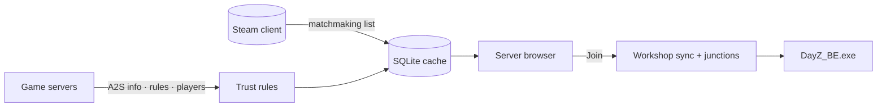

<div align="center">


# DZSA CrayZ Launcher

**A fast, honest server browser and one-click launcher for DayZ Standalone on Windows.**

Key-free server list straight from Steam · player counts verified with every server · Workshop mods synced and the game started through BattlEye in one click.

[](https://github.com/NobbyBo11ocks/dayz-launcher/releases/latest)
[](https://github.com/NobbyBo11ocks/dayz-launcher/actions/workflows/ci.yml)
[](https://github.com/NobbyBo11ocks/dayz-launcher/releases)
[](#install)
[](#install)
[](LICENSE)

[**⬇ Download**](https://github.com/NobbyBo11ocks/dayz-launcher/releases/latest) · [Screens](#a-look-around) · [What it does](#what-it-does) · [How it works](#how-it-works) · [Install](#install) · [Privacy](#privacy) · [Build](#build-from-source) · [Docs](docs/00-README.md)


</div>

---

## Why this launcher

|  |  |
|---|---|
| **Counts you can trust** | Every populated server is queried directly and cross-checked against Steam. Inflated and fabricated counts are flagged, and hidden by default. |
| **Fast and light** | A Rust host, a plain Svelte 5 front end, a virtualised table and a SQLite cache. The first screen is up well under a second after launch, the cached list with it, and the installer is under 5 MB. |
| **One click to the game** | Missing Workshop mods are subscribed and downloaded through Steam, the `!Workshop` junctions are created the way the official launcher does it, and DayZ starts through BattlEye with the official argument form. |
| **Nothing to sign up for** | No accounts, no API keys, no telemetry. It talks to Steam, to the game servers, to GitHub for updates, and to YouTube for the previews on the home page — which can be switched off. |

| Installer | Cold start to first frame | Refresh, then verify | Idle CPU | Memory, whole app |
|:-:|:-:|:-:|:-:|:-:|
| 4.7 MB | 0.43 s | 42 s + 19 s | 0.2 % of one core | ≈ 306 MB |

<sub>Installer, memory and idle CPU measured at v0.1.23; cold start at v0.1.19 (D-136); the refresh figure is the list arriving, with verified counts following it — 2 187 servers verified in 18.9 s at v0.1.26. Budgets, method and history in [docs/05 §6](docs/05-architecture-and-optimisation.md).</sub>

---

## A look around

<table>
<tr>
<td width="33%" valign="top">


**Home** — the latest DayZ posts with pictures and video previews, an unread badge on the rail, and a notification when an update lands. Switch the page off in Settings and nothing is ever fetched.

</td>
<td width="33%" valign="top">


**Settings** — a dark and a light theme, twelve accents, what the browser hides, how DayZ is started, saved launch profiles, and the Steam session with its idle release. One screen, no scrolling.

</td>
<td width="33%" valign="top">


**Logs** — what the launcher has been doing, both halves of it, with the file one click away, a chip per area to mute and a switch to stop recording altogether. Nothing leaves the machine.

</td>
</tr>
</table>

---

## What it does

<table>
<tr><th align="left" width="50%">Browse</th><th align="left" width="50%">Join</th></tr>
<tr valign="top"><td>

- Steam's own matchmaking list — no API key, the same list the in-game browser sees
- Filters for perspective, official or community hive, map, country, mod, queue, password, daytime, version, ping and friends
- Maps by the name people use — searching "Livonia" finds `enoch`, "Frostline" finds `sakhal`
- Country flags from an offline table, no lookups
- A details pane with the server's mods and installed ticks, 72 h population history, and your past sessions there
- Find every server running a given mod
- Favourites, a clearable Recent list, and import of the official launcher's favourites
- LAN discovery

</td><td>

- Missing mods subscribed, downloaded and linked automatically
- Wait for a free slot on a full server
- Launch profiles: saved sets of launch options, picked in the join dialog
- Direct connect by address; the game port is resolved to the query port
- A Workshop update is noticed from the running Steam client, not from a file it refreshes when it feels like it
- Joins that would be rejected are stopped before the game starts

</td></tr>
<tr><th align="left">Stay in touch</th><th align="left">Stay in control</th></tr>
<tr valign="top"><td>

- Home page with the latest DayZ updates, pictures and video previews
- An unread badge, and a notification when an update lands
- Friends' servers from Steam's game info and rich presence
- Friend markers on server rows, and a Friends filter

</td><td>

- Signed automatic updates
- Per-user installer; the launcher runs at the same elevation as Steam
- Steam idle release, so it does not count as playtime while it sits open
- A Logs page with per-area mutes and an off switch
- Confirmed clean-up of dangling `!Workshop` junctions
- A slim frameless window that remembers where it was, a dark and a light theme, twelve accent colours; the views that can fit do, and only their tables scroll
- DZSA list fallback when Steam is unavailable

</td></tr>
</table>

---

## How it works



1. **List.** The Steamworks matchmaking API supplies the server list with pings, the same list the in-game browser sees. It is cached in SQLite so the previous list appears instantly and is refreshed in the background.
2. **Verify.** Populated servers are queried directly with A2S (INFO, RULES, PLAYER). The advertised count is checked against the player list and against Steam; servers that fail the trust rules are marked inflated or fake.
3. **Join.** The join plan compares the server's mod list with your Workshop items, subscribes and downloads what is missing, creates `!Workshop\@<mod>` junctions matched by Workshop ID, and starts `DayZ_BE.exe` with the official argument form.
4. **Friends and news.** Friends' servers come from Steam's game info and rich presence. News comes from Steam's news feed for DayZ; pictures are shrunk on the host — 360 px for the cards, 640 for the featured one — so the window stays light.

Every protocol and launch fact is tied to a source in [docs/08](docs/08-sources.md), and every design choice to [docs/09](docs/09-decisions-log.md).

---

## Install

1. Download `DZSA CrayZ Launcher_<version>_x64-setup.exe` from the [latest release](https://github.com/NobbyBo11ocks/dayz-launcher/releases/latest).
2. Run it. It installs per user to `%LOCALAPPDATA%\Programs\DZSA CrayZ Launcher` and adds a Start menu entry. WebView2 is installed silently if Windows does not have it.
3. Start Steam, then the launcher. Updates are automatic: each release is signed with a minisign key and the app verifies the signature before installing.

> [!NOTE]
> **SmartScreen.** The installer is not code-signed yet, so Windows shows "Windows protected your PC" on first run. Click **More info**, then **Run anyway**. Code signing is tracked in [docs/12](docs/12-code-signing.md).

Requirements: Windows 10 or 11, 64-bit; Steam running and signed in; DayZ installed through Steam.

---

## Privacy

No accounts, no telemetry, no third-party analytics. The launcher talks to:

- **Steam** — the local client for the server list, Workshop and friends; Steam's news feed and image CDN for the home page.
- **The game servers** — direct A2S queries for ping, mods and players.
- **GitHub** — the update manifest and installer.
- **YouTube** — preview images for posts with a video, and `youtube-nocookie.com` while a video is playing. Only the News page does this, and it can be turned off in Settings; nothing else in the app contacts Google.
- **DZSA's public list** — only when Steam is unavailable and you choose to load it.

Its cache, favourites, history and settings stay in your local app-data folder.

---

## Build from source

Prerequisites: Node 24, Rust 1.98 or newer via rustup, Visual Studio 2022 Build Tools with the C++ x64 workload, and WebView2 (already part of Windows 11).

```bash
npm install
```

```bash
npm run tauri dev
```

The six checks CI runs, in order — `cargo fmt --check` is the one that catches people out:

```bash
npm run check
```

```bash
npm run build
```

```bash
cargo fmt --manifest-path src-tauri/Cargo.toml --check
```

```bash
cargo clippy --manifest-path src-tauri/Cargo.toml --all-targets -- -D warnings
```

```bash
cargo test --manifest-path src-tauri/Cargo.toml
```

```bash
node tools/nsis_template_check.js
```

<details>
<summary><b>Installer and updater signing</b></summary>

```bash
npm run tauri build
```

Output: `src-tauri/target/release/bundle/nsis/` (`DZSA CrayZ Launcher_<version>_x64-setup.exe` plus a `.sig` for the updater).

The per-user installer defaults to `%LOCALAPPDATA%\Programs\<product>`. `src-tauri/nsis/installer.nsi` is a copy of Tauri's stock template with that one line changed: the stock default is `%LOCALAPPDATA%\<product>`, which collided with the official DayZ Launcher's data folder under the app's original name, and the copy is kept because a program folder is where a program belongs. After upgrading `@tauri-apps/cli`, run `node tools/nsis_template_check.js` (add `--write` to refresh the copy from the new tag).

Updater artifacts are signed with a minisign key. The private key lives outside the repository (`%USERPROFILE%\.tauri\dayz-launcher.key`); set it before building:

```bash
TAURI_SIGNING_PRIVATE_KEY="$(cat ~/.tauri/dayz-launcher.key)" TAURI_SIGNING_PRIVATE_KEY_PASSWORD="" npm run tauri build -- --ci
```

`--ci` stops the CLI from prompting for the key password (the key has none). Run this from Git Bash; PowerShell drops empty environment variables, and without the password variable the CLI waits on a prompt forever.

The public key is in `src-tauri/tauri.conf.json`; the updater polls `https://github.com/NobbyBo11ocks/dayz-launcher/releases/latest/download/latest.json`.

</details>

<details>
<summary><b>Releasing</b></summary>

### Through GitHub Actions (preferred)

Bump `version` in `package.json`, `src-tauri/Cargo.toml` and `src-tauri/tauri.conf.json`, commit, then push a matching tag:

```bash
git tag vX.Y.Z && git push origin main vX.Y.Z
```

The [release workflow](.github/workflows/release.yml) builds the signed installer on a clean Windows runner, creates the release with generated notes, uploads the installer, its `.sig` and `latest.json`, smoke-installs the result, and verifies the published manifest. It needs **one** repository secret, set once from the machine that holds the key. In PowerShell:

```powershell
(Get-Content "$env:USERPROFILE\.tauri\dayz-launcher.key" -Raw).Trim() | gh secret set TAURI_SIGNING_PRIVATE_KEY --repo NobbyBo11ocks/dayz-launcher
```

or from Git Bash:

```bash
gh secret set TAURI_SIGNING_PRIVATE_KEY --repo NobbyBo11ocks/dayz-launcher < ~/.tauri/dayz-launcher.key
```

`--repo` lets the command run from any directory; without it `gh` reads the repository from the current folder's git remote and fails outside a checkout.

`TAURI_SIGNING_PRIVATE_KEY_PASSWORD` is not needed: our key has no password and the workflow builds with `--ci`, so the CLI never prompts. PowerShell also cannot pass it, because it drops an empty `""` argument and has no `<` redirection.

Run the workflow manually from the Actions tab for a build-only dry run.

### By hand

1. Bump `version` in the three files above, then run the signed build.
2. Create the GitHub release with the installer and its signature:

   ```bash
   gh release create vX.Y.Z "src-tauri/target/release/bundle/nsis/DZSA CrayZ Launcher_<version>_x64-setup.exe" "src-tauri/target/release/bundle/nsis/DZSA CrayZ Launcher_<version>_x64-setup.exe.sig" --title vX.Y.Z --notes-file notes.md
   ```

3. Generate the update manifest from the uploaded asset (GitHub renames spaces in asset names to dots, so the URL must come from the API) and upload it:

   ```bash
   node tools/make_latest.js vX.Y.Z --notes notes.md
   ```

   ```bash
   gh release upload vX.Y.Z src-tauri/target/release/bundle/nsis/latest.json --clobber
   ```

4. Check the release the way the app will see it (fetches the manifest through the endpoint, downloads the installer, verifies the minisign signature against the public key):

   ```bash
   node tools/verify_update_sig.js
   ```

</details>

<details>
<summary><b>Repository map</b></summary>

```text
src/                 Svelte 5 front end: views in src/lib, runes state in src/lib/state
src-tauri/src/       Rust host
  a2s/               Query protocol: packets, INFO, RULES (mods), PLAYER, client
  browser/           Server model, SQLite cache, population trust rules
  steam/             Registry, library VDFs, Workshop junctions, Steamworks thread
  launch/            Argument builder, mod links, DayZ_BE.exe process
  news.rs            Steam news feed and host-made thumbnails
  proc.rs            Priority classes and elevation matching
  log.rs             The app's own log: memory ring plus a rotating file
  geoip.rs           Offline IP-to-country lookup read in place from the image
  http.rs            Capped response bodies for every outbound fetch
src-tauri/nsis/      Installer template (stock Tauri template, install dir changed)
                     plus the header and sidebar bitmaps the setup wizard uses
docs/                Research, architecture, budgets, sources, decisions log
site/                The landing page
tools/               Node scripts: A2S probe and capture, GeoIP and flag builders, release helpers
```

</details>

<details>
<summary><b>Tools</b></summary>

| Command | Purpose |
|---|---|
| `node tools/a2s_probe.js <ip> <query-port>` | Query one server: INFO, RULES (mods) and PLAYER |
| `node tools/rules_failure_rate.js [sample] [concurrency]` | Sample live servers from the cache and report how many answer RULES |
| `node tools/verify_update_sig.js` | Fetch the live update manifest and verify the installer signature |
| `node tools/make_latest.js vX.Y.Z --notes notes.md` | Build `latest.json` from the uploaded release asset |
| `node tools/nsis_template_check.js` | Diff our NSIS template against the installed Tauri CLI's |
| `node tools/geoip_build.js` · `node tools/flags_build.js` | Rebuild the offline GeoIP table and the flag sprite |
| `node tools/make_icon.js` | Redraw the app icon and write `icon.ico` plus the PNG sizes. Needs `sharp`, which is not a project dependency: `npm i --no-save sharp` first |

</details>

---

## Credits

- IP geolocation by [DB-IP](https://db-ip.com) (IP to Country Lite, CC BY 4.0), compacted into `src-tauri/resources/geoip-v4.bin` by `tools/geoip_build.js`.
- Flag images from [flag-icons](https://github.com/lipis/flag-icons) (MIT), rasterised into `src/assets/flags.png` by `tools/flags_build.js`.
- Built with [Tauri](https://tauri.app), [Svelte](https://svelte.dev) and the [steamworks](https://crates.io/crates/steamworks) crate.

DayZ is a trademark of Bohemia Interactive. This project is not affiliated with or endorsed by Bohemia Interactive or Valve.

## License

**All rights reserved** ([LICENSE](LICENSE)). The source is public so you can read it, audit it and build it for your own use. Selling it, rebranding it, or redistributing it in any form needs written permission. Third-party components keep their own licences.
