<div align="center">

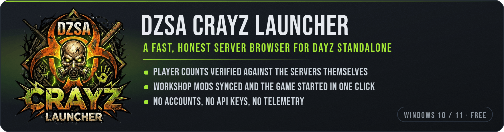

<br><br>

[](https://github.com/NobbyBo11ocks/DayZ-Launcher/releases/latest)
[](https://github.com/NobbyBo11ocks/DayZ-Launcher/actions/workflows/ci.yml)
[](https://github.com/NobbyBo11ocks/DayZ-Launcher/releases)
[](#install)
[](#install)
[](#what-it-talks-to)

<br>

<a href="https://github.com/NobbyBo11ocks/DayZ-Launcher/releases/latest"></a>

<br><br>

**The DayZ server browser that counts the players itself.**<br>
Fake populations flagged and hidden. Mods synced and the game started in one click. No accounts, no ads, no sponsored servers.

<sub>

[Why](#why-it-exists) · [Compared](#how-it-compares) · [Tour](#a-tour) · [Everything it does](#everything-it-does) · [How it works](#how-it-works) · [Install](#install) · [FAQ](#faq) · [Build](#build-from-source)

</sub>

<br>


</div>

---

## Why it exists

DayZ's server list sorts by population, so a server that says it has forty players gets seen and one that says it has none does not. Plenty of servers take the shortcut and report players who are not there. **The in-game list, the official launcher and DZSA all show you the number the server reports.**

This one opens each populated server's own player list, counts who is actually connected, and checks the answer against Steam and against the previous look. On 25 September 2026 a full refresh listed **36 100 servers, and 30 011 of them — 83 % — claimed players Steam itself said were not there.** They are hidden by default. Untick one box and they are back, each with the reason it failed.

<table>
<tr>
<td width="25%" align="center" valign="top">

### ✅ Real counts

Players counted on the server's own list, cross-checked with Steam, and compared with the last check. Fakes are flagged and hidden.

</td>
<td width="25%" align="center" valign="top">

### ⚡ One click in

Missing mods subscribed, downloaded and linked, then DayZ starts with the server's own load order.

</td>
<td width="25%" align="center" valign="top">

### 🪶 Light

A 7.7 MB installer, the first screen in under half a second, and a list that handles 70 000 cached servers.

</td>
<td width="25%" align="center" valign="top">

### 🔒 Yours

No account, no API key, no ads, no sponsored placements and no telemetry. Every address it talks to is listed below.

</td>
</tr>
</table>

---

## How it compares

<table>
<tr><th align="left" width="24%"></th><th align="left" width="40%">DZSA CrayZ Launcher</th><th align="left" width="36%">DZSA Launcher</th></tr>
<tr><td><b>Where the list comes from</b></td><td>✅ Steam's own server list: every DayZ server that reports to Steam, nothing to register</td><td>DZSA's own backend: servers registered with it</td></tr>
<tr><td><b>The player count you see</b></td><td>✅ Players counted on the server's own list, cross-checked with Steam</td><td>The number the server advertises</td></tr>
<tr><td><b>Fake populations</b></td><td>✅ Flagged, explained in plain words, hidden by default</td><td>—</td></tr>
<tr><td><b>Sponsored listings</b></td><td>✅ None: the order is players who are really there</td><td>Sponsored listings, a month at a time</td></tr>
<tr><td><b>Mods for a server</b></td><td>✅ Subscribed, downloaded and linked in one click, with the rate and the time left</td><td>✅ Subscribed through the Workshop, missing ones shown</td></tr>
<tr><td><b>Mod load order</b></td><td>✅ The server's own order</td><td>—</td></tr>
<tr><td><b>Country flags</b></td><td>✅ From an offline table, no lookups</td><td>❌</td></tr>
<tr><td><b>Population history</b></td><td>✅ 72 hours per server</td><td>❌</td></tr>
<tr><td><b>Friends</b></td><td>✅ Who is on which server, with Join beside them</td><td>—</td></tr>
<tr><td><b>Full server</b></td><td>✅ Waits for a free slot and joins the moment one opens</td><td>—</td></tr>
<tr><td><b>Performance options</b></td><td>✅ <code>-cpuCount</code>, <code>-maxMem</code> and <code>-maxVRAM</code> sized to your PC</td><td>—</td></tr>
<tr><td><b>Look</b></td><td>✅ Dark and light themes, twelve accent colours</td><td>❌ One dark table</td></tr>
<tr><td><b>Updates</b></td><td>✅ In the app, one click, and signed so a tampered installer is refused</td><td>—</td></tr>
</table>

<sub>DZSA Launcher as checked on its portable build 0.0.6.3 and on dayzsalauncher.com (2026-09-21 and 2026-09-26); — means we found no such feature there, and corrections are welcome. Both launchers use the same <code>!Workshop</code> folder, so they can live side by side. So can Bohemia's official launcher: this one follows its mod order and imports its favourites in one click.</sub>

---

## A tour

<table>
<tr>
<td width="60%" valign="top">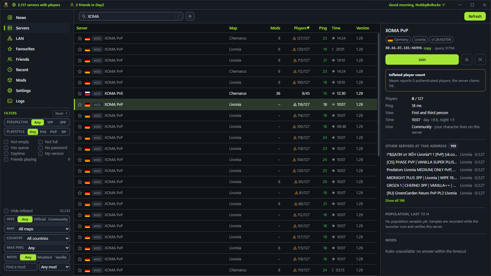</td>
<td width="40%" valign="top">

### 🕵️ Spot the farms

Untick **Hide inflated**, search for a name, and the list tells on it: the same server dozens of times, every copy claiming 100–127 players, every one marked ⚠. Open one and the pane says why in plain words: **Steam reports 0 authenticated players; the server claims 116**, next to **199 other servers at the same address**.

Every verdict explains itself:
**Verified head-count** · **Inflated player count** · **Fabricated player list** · **Refuses player queries** · **Not answering** · **Name taken from another server** · **Implausible player count** · **Empty server**

</td>
</tr>
<tr>
<td width="40%" valign="top">

### 🎯 From the list to the game in one click

Join shows the plan first: which of the server's mods you have, what is missing and how big it is. One button subscribes, downloads and links them all, with the rate and the time left, then starts DayZ with the server's own load order.

- **Server full?** Wait here and join the moment a slot opens.
- **A password** when the server has one, and **your saved launch profiles**, in the same dialog.
- **Performance sized to your PC:** `-cpuCount`, `-maxMem` and `-maxVRAM` from your own threads, memory and graphics card, unless you set them yourself.

</td>
<td width="60%" valign="top">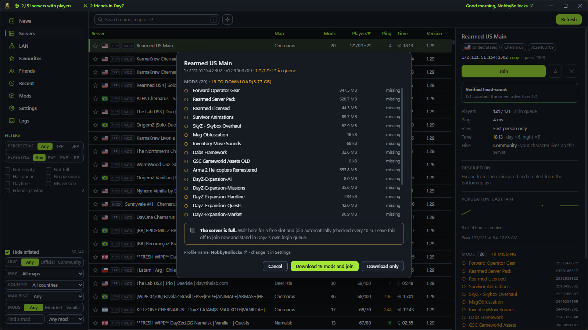</td>
</tr>
<tr>
<td width="60%" valign="top">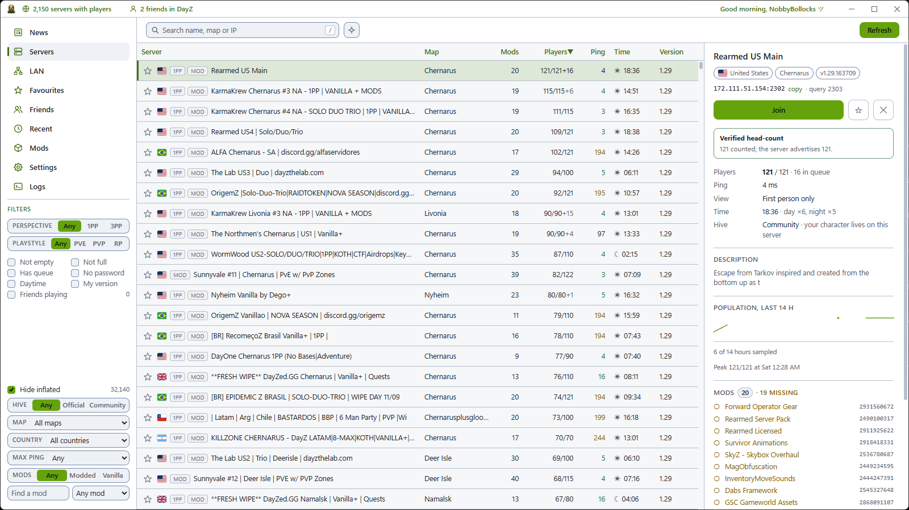</td>
<td width="40%" valign="top">

### 🎨 Dark or light, your colour

A dark and a light theme and twelve accent colours. Every filter lives in the left rail, all in view at once: perspective, playstyle, hive, map, country, ping, mods, queue, password, daytime, version and friends. The lower half — hide inflated, hive, map, country, ping and mods — sits at the bottom of the rail.

Maps go by the names people use: *Livonia* finds `enoch`, *Frostline* finds `sakhal`.

</td>
</tr>
<tr>
<td width="40%" valign="top">

### 👥 Friends and favourites

Who is online, who is in DayZ and on which server, straight from Steam, with **Join** beside anyone you can follow in. Friend markers show on the server rows too, with a Friends filter.

Star any server and it lands in **Favourites** with the same verified counts. Your official-launcher favourites import in one click.

</td>
<td width="60%" valign="top">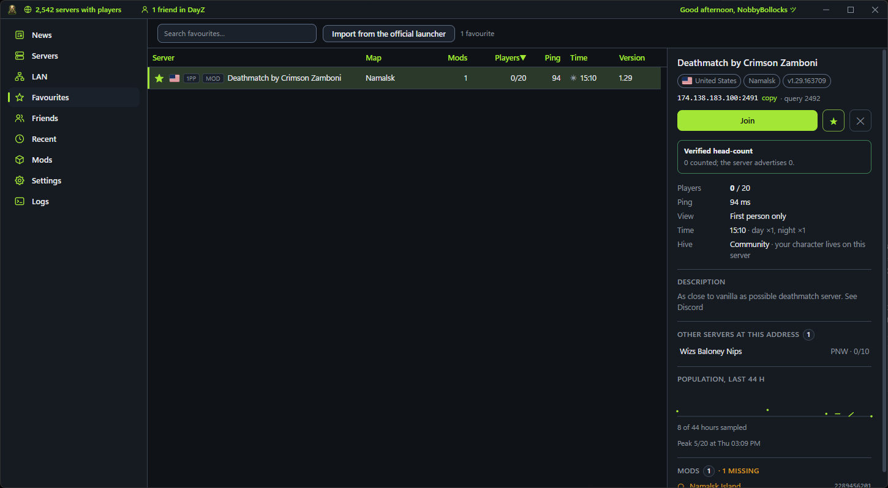</td>
</tr>
</table>

<table>
<tr>
<td width="50%" valign="top">

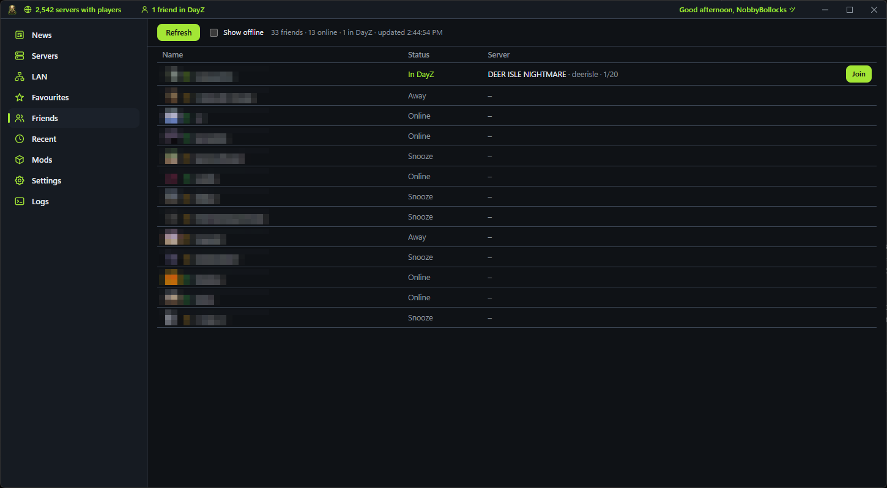

**Friends** — status and server for everyone online, straight from Steam.

</td>
<td width="50%" valign="top">

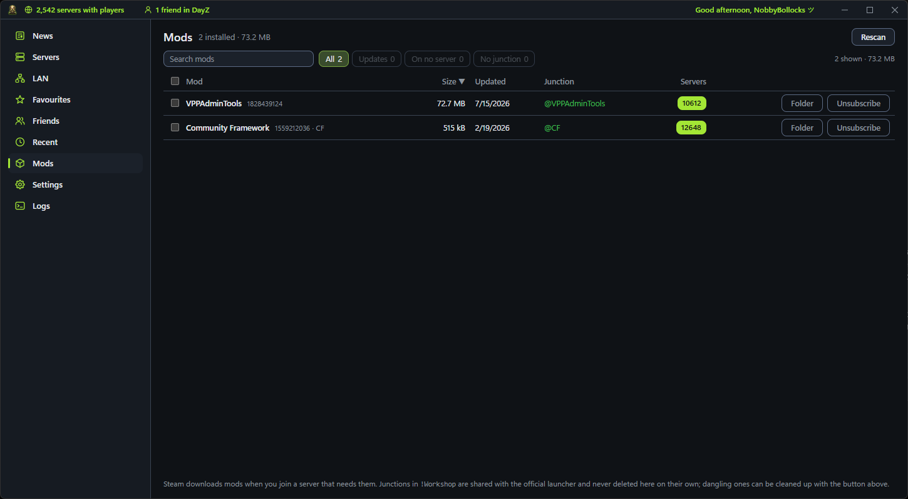

**Mods** — size, last update, `!Workshop` junction and how many servers run each one, with Folder and Unsubscribe beside it.

</td>
</tr>
<tr>
<td width="50%" valign="top">

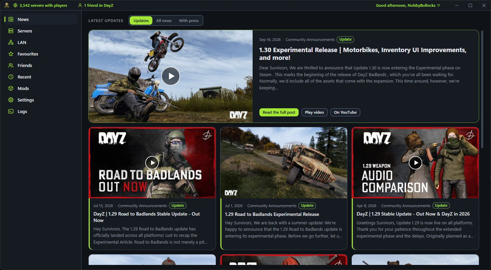

**News** — the latest DayZ posts with pictures and video previews, an unread badge, and a notification when an update lands. Off with one switch, and then nothing is fetched.

</td>
<td width="50%" valign="top">

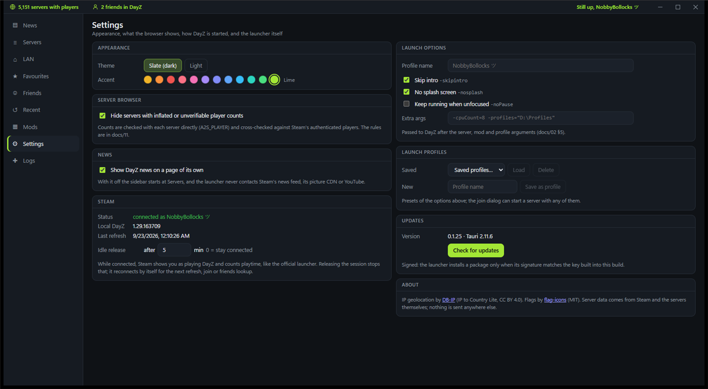

**Settings** — themes and accents, what the browser hides, how DayZ starts, saved launch profiles, the Steam session with its idle release, and updates.

</td>
</tr>
<tr>
<td width="50%" valign="top">

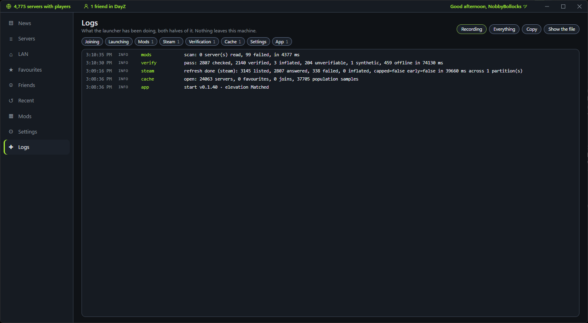

**Logs** — what the launcher has been doing, with the file one click away, a chip per area to mute and a switch to stop recording. Nothing leaves your PC.

</td>
<td width="50%" valign="top">

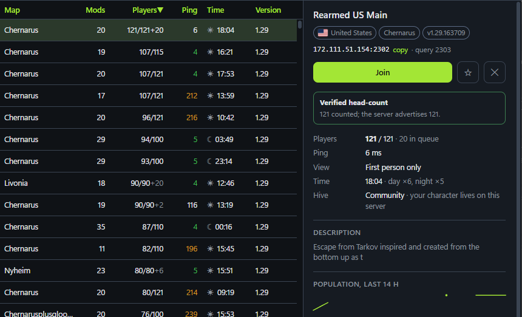

**Details** — the verdict, players and queue, ping, perspective, time of day and its speed, hive, description, population history, every mod with an installed tick, and the other servers at the same address.

</td>
</tr>
</table>

---

## Everything it does

<table>
<tr><th align="left" width="50%">🔎 Browse</th><th align="left" width="50%">🎮 Join</th></tr>
<tr valign="top"><td>

- Steam's own server list: no API key, the same list the in-game browser sees
- **Player counts checked** against each server's own list, Steam and the previous check; fakes hidden by default, each with its reason
- Every filter in one rail: perspective, **PVE / PVP / RP**, official or community hive, map, country, ping, mods, a specific mod, queue, password, daytime, version, friends
- Search matches descriptions too, so *trader* finds servers whose name never says it
- **Maps by the names people use**
- Country flags from an offline table, no lookups
- A details pane with mods and installed ticks, population history, and **the other servers at the same address**
- Favourites, a clearable Recent list, and import of the official launcher's favourites
- LAN discovery, and direct connect by address

</td><td>

- Missing mods subscribed, downloaded and linked, with **the rate and how long is left**
- **The server's own mod load order**
- **Wait for a free slot** on a full server, then start the moment one opens
- Launch profiles: saved sets of options, picked in the join dialog
- **DayZ's performance limits sized to your PC**, unless you set your own
- Workshop updates read from the running Steam client
- Joins that would be rejected are stopped before the game starts

</td></tr>
<tr><th align="left">👥 Stay in touch</th><th align="left">🛡️ Stay in control</th></tr>
<tr valign="top"><td>

- The latest DayZ updates with pictures and video previews
- An unread badge, and a notification when an update lands
- Friends' servers from Steam, with Join beside them
- Friend markers on server rows, and a Friends filter

</td><td>

- Signed one-click updates
- A per-user installer; the launcher runs at the same elevation as Steam
- **Steam idle release**, so an open launcher does not count as playtime
- A Logs page with per-area mutes and an off switch
- Confirmed clean-up of dangling `!Workshop` junctions, and never one you did not confirm
- A slim window that remembers where it was
- DZSA's public list as a fallback when Steam is unavailable

</td></tr>
</table>

---

## How it works

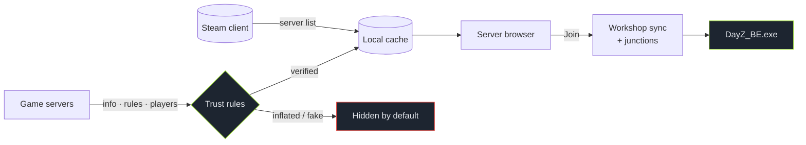

1. **List.** Steam supplies the server list with pings, the same list the in-game browser sees. It is cached locally, so the last list appears instantly while the new one comes in.
2. **Check.** Every populated server is asked directly for its info, rules and player list. The advertised count is checked against the players actually listed, against Steam's own count, and against the previous check: real sessions carry over between checks advanced by the time that passed, while a fabricated list is drawn afresh every time. A claim above 127 players — more than any DayZ server has been counted holding — and an exact copy of a verified server's name on another address count against a row too. The rules, and what each one caught, are in [docs/11](docs/11-fake-population-detection.md).
3. **Join.** The join plan compares the server's mods with yours, subscribes to and downloads what is missing, links each one into `!Workshop` by its Workshop ID, and starts `DayZ_BE.exe` the way the official launcher does, in the server's own load order, with the performance limits sized to your PC.
4. **Friends and news.** Friends' servers come from Steam. News comes from Steam's feed for DayZ, with pictures shrunk on your PC so the window stays light.

> [!NOTE]
> Every protocol and launch fact is tied to a primary source in [docs/08](docs/08-sources.md), and every design decision to [docs/09](docs/09-decisions-log.md), including the ones that turned out to be wrong and what replaced them.

### The numbers

| Installer | Cold start to first frame | Refresh, then verify | Idle CPU | Memory, whole app |
|:-:|:-:|:-:|:-:|:-:|
| **7.7 MB** | **0.43 s** | **≈ 30 s + ≈ 26 s** | **0.2 %** of one core | **≈ 306 MB** |

<sub>Installer measured at v0.1.59. Refresh and verify from the app's own log on 2026-09-26: 2 366 servers listed in 30.0 s, then 2 193 checked in 26.2 s. Memory and idle CPU at v0.1.23; cold start at v0.1.19. Budgets, method and history in [docs/05 §6](docs/05-architecture-and-optimisation.md).</sub>

---

## Install

1. Download `DZSA CrayZ Launcher_<version>_x64-setup.exe` from the [latest release](https://github.com/NobbyBo11ocks/DayZ-Launcher/releases/latest).
2. Run it. It installs per user to `%LOCALAPPDATA%\Programs\DZSA CrayZ Launcher` and adds a Start menu entry. WebView2 is installed silently if Windows does not have it.
3. Start Steam, then the launcher. Updates are one click: the launcher checks for a new release when it starts and when you come back to its window (at most once a day) and offers it in Settings and the side rail; each release is signed with a minisign key and the app verifies the signature before installing.

> [!WARNING]
> **SmartScreen.** The installer is not code-signed yet, so Windows shows "Windows protected your PC" on first run. Click **More info**, then **Run anyway**. Code signing is tracked in [docs/12](docs/12-code-signing.md).

**Requirements:** Windows 10 or 11, 64-bit · Steam running and signed in · DayZ installed through Steam.

---

## What it talks to

No accounts, no telemetry, no third-party analytics. In full:

| Destination | What for | When |
|---|---|---|
| **Steam, on your machine** | The server list, the Workshop, your friends | Always |
| **The game servers** | A2S queries for ping, mods and who is really on them | Refresh and verification |
| **GitHub** | The update manifest and the installer | Update checks |
| **Steam's news feed and image CDN** | The home page | Only with the News page on |
| **YouTube** | Preview images, and `youtube-nocookie.com` while a video plays | Only with the News page on |
| **DZSA's public list** | A fallback server list | Only when Steam is unavailable and you ask |
| **Microsoft** | The WebView2 runtime, if the installer finds none | Installing, once |

Your cache, favourites, history and settings stay in your own app-data folder. The Logs page shows exactly what the launcher has been doing, and you can copy it, mute it by area, or switch it off. One thing to know before pasting a report somewhere public: the join dialog's command line names your Steam profile and your library paths (the password is masked).

---

## FAQ

<details>
<summary><b>Is it safe with BattlEye?</b></summary>

It starts DayZ the way Bohemia's own launcher does, through `DayZ_BE.exe` with the same argument form, and never modifies the game's own files or its memory. The mods it links are the Workshop items Steam downloaded, in the `!Workshop` folder the official launcher uses.

</details>

<details>
<summary><b>Can I keep DZSA Launcher or the official launcher installed?</b></summary>

Yes. All three use the same `!Workshop` junctions. This one never deletes a junction on its own; the one clean-up it offers removes only junctions whose mod folder is gone, and only after you confirm it.

</details>

<details>
<summary><b>Why are so many servers hidden?</b></summary>

Their player count cannot be trusted: Steam sees nobody on them, their player list does not match what they advertise, or the list is fabricated. Untick **Hide inflated** to see them all; the details pane says what each one failed.

</details>

<details>
<summary><b>Why does Windows warn me when I install it?</b></summary>

The installer is not code-signed yet, so SmartScreen shows "Windows protected your PC". Click **More info**, then **Run anyway**. Updates are signed with the launcher's own key and checked before they install, so an altered installer is refused.

</details>

<details>
<summary><b>Does it cost anything?</b></summary>

No. There are no ads, no accounts, no paid or sponsored placements in the list, and nothing is uploaded about you.

</details>

<details>
<summary><b>Does it need Steam running?</b></summary>

Yes: the server list, the Workshop downloads and your friends come from the Steam client. When Steam is not available, DZSA's public list can be loaded instead, on request.

</details>

---

## Build from source

Prerequisites: Node 24, Rust 1.98 or newer via rustup, Visual Studio 2022 Build Tools with the C++ x64 workload, and WebView2 (already part of Windows 11).

```bash
npm install
```

```bash
npm run tauri dev
```

The seven checks CI runs, in order — `cargo fmt --check` is the one that catches people out:

```bash
npm run check
```

```bash
npm run build
```

```bash
cargo fmt --manifest-path src-tauri/Cargo.toml --check
```

```bash
cargo clippy --manifest-path src-tauri/Cargo.toml --all-targets -- -D warnings
```

```bash
cargo test --manifest-path src-tauri/Cargo.toml
```

```bash
node tools/nsis_template_check.js
```

```bash
node tools/workflow_check.js
```

<details>
<summary><b>Installer and updater signing</b></summary>

```bash
npm run tauri build
```

Output: `src-tauri/target/release/bundle/nsis/` (`DZSA CrayZ Launcher_<version>_x64-setup.exe` plus a `.sig` for the updater).

`src-tauri/nsis/installer.nsi` is a copy of Tauri's stock template carrying **nine deviations in seventeen marked blocks**, plus one new file (`nsis/hooks.nsh`) on Tauri's own extension point. Each deviation is bracketed by `; >>> dzl-change:` and carries the upstream lines it replaces, so `node tools/nsis_template_check.js` puts them all back and compares against the real thing rather than keeping a second copy of what we wrote (D-205):

1. The per-user default install directory is `%LOCALAPPDATA%\Programs\<product>` rather than `%LOCALAPPDATA%\<product>`, which collided with the official DayZ Launcher's data folder under this app's original name (D-067).
2. An options page before anything is written, so the news question is answered before the launcher has ever run (D-206), and `/NONEWS` for silent installs.
3. A straight upgrade skips the reinstall page entirely. Upstream shows it on every reinstall with *uninstall* pre-selected, and choosing it runs the previous version's uninstaller in the middle of the install — which is where the "delete application data" checkbox lives (D-207).
4. The uninstaller an upgrade does run is passed `/UPDATE /S`, as belt to that braces (D-205).
5. The Add/Remove Programs entry survives an upgrade, so an interrupted one still leaves a way back (D-214).
6. The install waits for the old binary's lock to clear before overwriting it, because WebView2's children outlive the host (D-214).
7. `AllowSkipFiles off`: NSIS otherwise skips a locked file, and a silent install exited 0 having changed nothing while writing the new version to Add/Remove Programs (D-205).
8. The launcher's own look on every page, uninstaller included: its dark surfaces, light text and lime accent, the logo beside the welcome and finish pages, the gas mask in the header, and a splash for an interactive install that silent, passive and update runs never show. Each picture comes in seven sizes, one per common display scale, and the installer loads the one made for the screen it is on (D-258).
9. Shortcut icons that follow an update. Explorer keeps the icon it drew for a shortcut by the icon's location, and Tauri's shortcuts take theirs from the exe, whose path never changes — so an update that changed the icon left the desktop and Start menu shortcuts and a pinned taskbar button showing the old one (D-260). The installer now writes a copy of the icon named after the version and points every shortcut of ours at it, the pinned button included, then asks Windows to refresh; most of that lives in `hooks.nsh`, and the one marked block gives the Finish page's desktop shortcut the same icon (D-262).

In-app updates were never affected by any of this — the updater always passes `/UPDATE`.

After upgrading `@tauri-apps/cli`, run the check (add `--write` to refresh the copy from the new tag and re-apply every marked change).

The logo is cut out of its source picture (`docs/art/logo-source.jpg`) by `node tools/logo_cutout.js`, and everything else is made from the result: the app icon and its gas-mask emblem by `tools/make_icon.js`, the installer's artwork by `tools/nsis_art.js`, the README banner by `tools/readme_banner.js`. So none of them can drift from the others.

Updater artifacts are signed with a minisign key. The private key lives outside the repository (`%USERPROFILE%\.tauri\dayz-launcher.key`); set it before building:

```bash
TAURI_SIGNING_PRIVATE_KEY="$(cat ~/.tauri/dayz-launcher.key)" TAURI_SIGNING_PRIVATE_KEY_PASSWORD="" npm run tauri build -- --ci
```

`--ci` stops the CLI from prompting for the key password (the key has none). Run this from Git Bash; PowerShell drops empty environment variables, and without the password variable the CLI waits on a prompt forever.

The public key is in `src-tauri/tauri.conf.json`; the updater checks `https://github.com/NobbyBo11ocks/DayZ-Launcher/releases/latest/download/latest.json`.

</details>

<details>
<summary><b>Releasing</b></summary>

### Through GitHub Actions (preferred)

Bump `version` in `package.json`, `src-tauri/Cargo.toml` and `src-tauri/tauri.conf.json`, commit, then push a matching tag:

```bash
git tag vX.Y.Z && git push origin main vX.Y.Z
```

The [release workflow](.github/workflows/release.yml) builds the signed installer on a clean Windows runner, creates the release as a draft with generated notes, uploads the installer, its `.sig` and `latest.json`, smoke-installs the result, publishes the draft only when that passes, and verifies the published manifest; a draft a failed run leaves is deleted. It needs **one** repository secret, set once from the machine that holds the key. In PowerShell:

```powershell
(Get-Content "$env:USERPROFILE\.tauri\dayz-launcher.key" -Raw).Trim() | gh secret set TAURI_SIGNING_PRIVATE_KEY --repo NobbyBo11ocks/DayZ-Launcher
```

or from Git Bash:

```bash
gh secret set TAURI_SIGNING_PRIVATE_KEY --repo NobbyBo11ocks/DayZ-Launcher < ~/.tauri/dayz-launcher.key
```

`--repo` lets the command run from any directory; without it `gh` reads the repository from the current folder's git remote and fails outside a checkout.

`TAURI_SIGNING_PRIVATE_KEY_PASSWORD` is not needed: our key has no password and the workflow builds with `--ci`, so the CLI never prompts. PowerShell also cannot pass it, because it drops an empty `""` argument and has no `<` redirection.

Run the workflow manually from the Actions tab for a build-only dry run.

### By hand

1. Bump `version` in the three files above, then run the signed build.
2. Create the GitHub release with the installer and its signature:

   ```bash
   gh release create vX.Y.Z "src-tauri/target/release/bundle/nsis/DZSA CrayZ Launcher_<version>_x64-setup.exe" "src-tauri/target/release/bundle/nsis/DZSA CrayZ Launcher_<version>_x64-setup.exe.sig" --title vX.Y.Z --notes-file notes.md
   ```

3. Generate the update manifest from the uploaded asset (GitHub renames spaces in asset names to dots, so the URL must come from the API) and upload it:

   ```bash
   node tools/make_latest.js vX.Y.Z --notes notes.md
   ```

   ```bash
   gh release upload vX.Y.Z src-tauri/target/release/bundle/nsis/latest.json --clobber
   ```

4. Check the release the way the app will see it (fetches the manifest through the endpoint, downloads the installer, verifies the minisign signature against the public key):

   ```bash
   node tools/verify_update_sig.js
   ```

</details>

<details>
<summary><b>Repository map</b></summary>

```text
src/                 Svelte 5 front end: views in src/lib, runes state in src/lib/state
src-tauri/src/       Rust host
  a2s/               Query protocol: packets, INFO, RULES (mods), PLAYER, client
  browser/           Server model, SQLite cache, population trust rules
  steam/             Registry, library VDFs, Workshop junctions, Steamworks thread
  launch/            Argument builder, mod links, DayZ_BE.exe process
  news.rs            Steam news feed and host-made thumbnails
  proc.rs            Priority classes and elevation matching
  log.rs             The app's own log: memory ring plus a rotating file
  geoip.rs           Offline IP-to-country lookup read in place from the image
  http.rs            Capped response bodies for every outbound fetch
src-tauri/nsis/      Installer template (Tauri's stock template with nine marked deviations)
                     plus the header and sidebar bitmaps the setup wizard uses
docs/                Research, architecture, budgets, sources, decisions log
site/                The landing page
tools/               Node scripts: A2S probe and capture, GeoIP and flag builders, release helpers
```

</details>

<details>
<summary><b>Tools</b></summary>

| Command | Purpose |
|---|---|
| `node tools/a2s_probe.js <ip> <query-port>` | Query one server: INFO, RULES (mods) and PLAYER |
| `node tools/rules_failure_rate.js [sample] [concurrency]` | Sample live servers from the cache and report how many answer RULES |
| `node tools/verify_update_sig.js` | Fetch the live update manifest and verify the installer signature |
| `node tools/make_latest.js vX.Y.Z --notes notes.md` | Build `latest.json` from the uploaded release asset |
| `node tools/nsis_template_check.js` | Diff our NSIS template against the installed Tauri CLI's |
| `node tools/geoip_build.js` · `node tools/flags_build.js` | Rebuild the offline GeoIP table and the flag sprite |
| `node tools/logo_cutout.js` | Cut the logo out of `docs/art/logo-source.jpg` into `docs/art/logo.png`; only needed for a new source picture. Needs `sharp`, which is deliberately not a project dependency: `npm i --no-save sharp` first, and note that `npm ci` removes it again. The next three need it too |
| `node tools/make_icon.js` | Cut the gas mask out of the logo as the app icon and write `icon.ico` plus the PNG sizes |
| `node tools/nsis_art.js` · `node tools/readme_banner.js` | Rebuild the installer's artwork and the README banner from the logo |

</details>

---

## Credits

- IP geolocation by [DB-IP](https://db-ip.com) (IP to Country Lite, CC BY 4.0), compacted into `src-tauri/resources/geoip-v4.bin` by `tools/geoip_build.js`.
- Flag images from [flag-icons](https://github.com/lipis/flag-icons) (MIT), rasterised into `src/assets/flags.png` by `tools/flags_build.js`.
- Built with [Tauri](https://tauri.app), [Svelte](https://svelte.dev) and the [steamworks](https://crates.io/crates/steamworks) crate.

DayZ is a trademark of Bohemia Interactive. This project is not affiliated with or endorsed by Bohemia Interactive or Valve.

## License

**All rights reserved** ([LICENSE](LICENSE)). The source is public so you can read it, audit it and build it for your own use. Selling it, rebranding it, or redistributing it in any form needs written permission. Third-party components keep their own licences.
