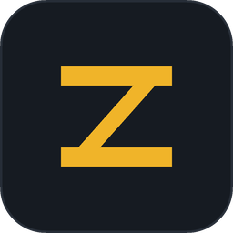
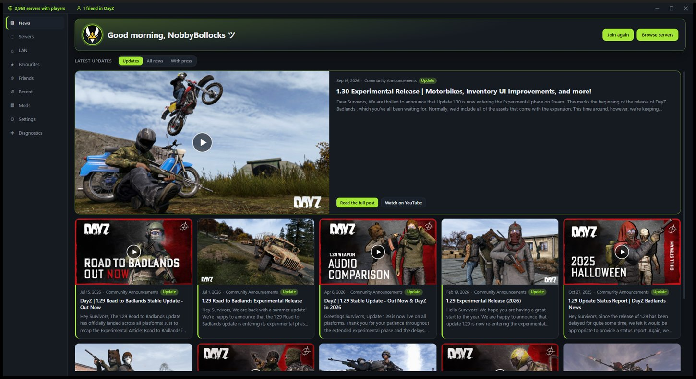
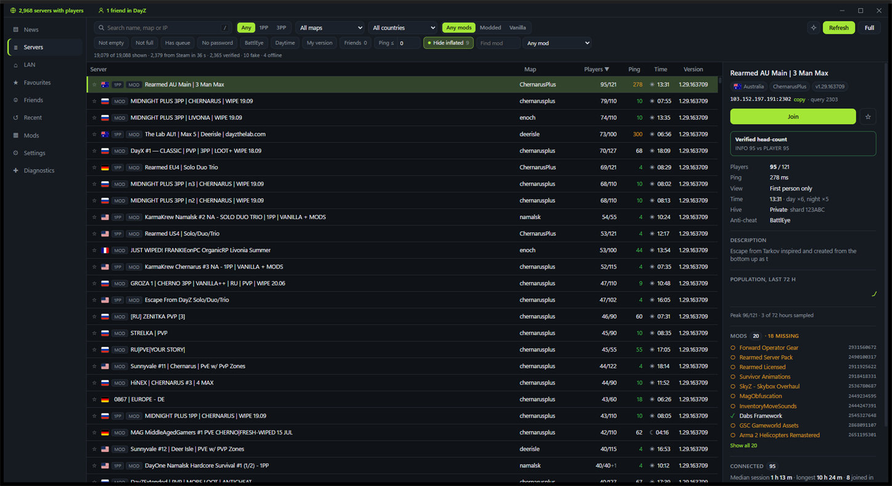
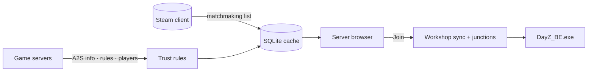

<div align="center">



# DayZ Launcher

**A fast, honest server browser and one-click launcher for DayZ Standalone on Windows.**

Key-free server list straight from Steam · player counts verified with every server · Workshop mods synced and the game started through BattlEye in one click.

[](https://github.com/NobbyBo11ocks/dayz-launcher/releases/latest)
[](https://github.com/NobbyBo11ocks/dayz-launcher/actions/workflows/ci.yml)
[](https://github.com/NobbyBo11ocks/dayz-launcher/releases)
[](#install)
[](LICENSE)

[**Download the latest release**](https://github.com/NobbyBo11ocks/dayz-launcher/releases/latest) · [Highlights](#highlights) · [How it works](#how-it-works) · [Install](#install) · [Build](#build-from-source) · [Docs](docs/00-README.md)



</div>

## Why this launcher

- **Player counts you can trust.** Every populated server is queried directly and cross-checked against Steam. Inflated and fabricated counts are flagged, and hidden by default.
- **Fast and light.** A Rust host, a plain Svelte 5 front end, a virtualised table and a SQLite cache. The last list is on screen well under a second after launch, and the installer is under 5 MB.
- **One click from list to game.** Missing Workshop mods are subscribed and downloaded through Steam, the `!Workshop` junctions are created the way the official launcher does it, and DayZ starts through BattlEye with the official argument form.
- **Nothing to sign up for.** No accounts, no API keys, no telemetry. It talks to Steam, to the game servers, and to GitHub for updates.

| Installer | Cached list on screen | Populated-server refresh | Idle host CPU | Memory, whole app |
|:-:|:-:|:-:|:-:|:-:|
| 4.7 MB | ≈ 0.7 s | ≈ 38 s | 0.1 % | 235–305 MB |

<sub>Measured on the reference machine; budgets, method and history in [docs/05 §6](docs/05-architecture-and-optimisation.md).</sub>

## Highlights

| Browse | Join |
|---|---|
| Steam's own matchmaking list, no API key.<br>Filters for perspective, map, country, mod, queue, password, BattlEye, daytime, version, ping and friends.<br>Country flags from an offline table.<br>Live details: mods with installed ticks, 72 h population history, your past sessions on that server.<br>Find servers by mod. | Missing mods subscribed, downloaded and linked automatically.<br>Wait for a free slot on a full server.<br>Launch profiles: saved sets of launch options, picked in the join dialog.<br>Direct connect by address; the game port is resolved to the query port.<br>Mod management: update, unsubscribe. |
| **Stay in touch** | **Stay in control** |
| Home page with your Steam name and avatar, "Join again", and the latest DayZ updates with pictures and video previews, an unread badge and an alert when an update lands.<br>Friends: who is in DayZ, on which server, and a Join button; friend markers on server rows and a Friends filter.<br>LAN discovery.<br>Favourites with alerts (free slot, back online) as Windows toasts, a clearable list of recent servers, and import of the official launcher's favourites. | Signed automatic updates.<br>Per-user installer; the launcher runs at the same elevation as Steam.<br>Steam idle release, so the launcher does not count as playtime while it sits open.<br>Diagnostics with a performance section, cache counts and a confirmed clean-up of dangling `!Workshop` junctions.<br>Slim frameless window that remembers its size and position, a dark and a light theme, twelve accent colours; every view except the server list fits without scrolling.<br>Nothing to sign in to and nothing sent anywhere but Steam, the servers and GitHub.<br>DZSA list fallback when Steam is unavailable. |

<div align="center">



<sub>The browser: flags, verified counts, quick filters, and a details pane with the server's mods, population history and your sessions.</sub>

</div>

## How it works



1. **List.** The Steamworks matchmaking API supplies the server list with pings, the same list the in-game browser sees. It is cached in SQLite so the previous list appears instantly and is refreshed in the background.
2. **Verify.** Populated servers are queried directly with A2S (INFO, RULES, PLAYER). The advertised count is checked against the player list and against Steam; servers that fail the trust rules are marked inflated or fake.
3. **Join.** The join plan compares the server's mod list with your Workshop items, subscribes and downloads what is missing, creates `!Workshop\@<mod>` junctions matched by Workshop ID, and starts `DayZ_BE.exe` with the official argument form.
4. **Friends and news.** Friends' servers come from Steam's game info and rich presence. News comes from Steam's news feed for DayZ; pictures are shrunk to 640 px thumbnails on the host so the window stays light.

Every protocol and launch fact is tied to a source in [docs/08](docs/08-sources.md), and every design choice to [docs/09](docs/09-decisions-log.md).

## Install

1. Download `DayZ Launcher_<version>_x64-setup.exe` from the [latest release](https://github.com/NobbyBo11ocks/dayz-launcher/releases/latest).
2. Run it. It installs per user to `%LOCALAPPDATA%\Programs\DayZ Launcher` and adds a Start menu entry. WebView2 is installed silently if Windows does not have it.
3. Start Steam, then the launcher. Updates are automatic: each release is signed with a minisign key and the app verifies the signature before installing.

> **SmartScreen.** The installer is not code-signed yet, so Windows shows "Windows protected your PC" on first run. Click **More info**, then **Run anyway**. Code signing is tracked in [docs/12](docs/12-code-signing.md).

Requirements: Windows 10 or 11, 64-bit; Steam running and signed in; DayZ installed through Steam.

## Privacy

No accounts, no telemetry, no third-party analytics. The launcher talks to:

- **Steam**: the local client for the server list, Workshop and friends; Steam's news feed and image CDN for the home page.
- **The game servers**: direct A2S queries for ping, mods and players.
- **GitHub**: the update manifest and installer.
- **DZSA's public list**: only when Steam is unavailable and you choose to load it.

Its cache, favourites, history and settings stay in your local app-data folder.

## Build from source

Prerequisites: Node 24, Rust 1.98 or newer via rustup, Visual Studio 2022 Build Tools with the C++ x64 workload, and WebView2 (already part of Windows 11).

```bash
npm install
```

```bash
npm run tauri dev
```

The checks CI runs:

```bash
npm run check
```

```bash
cargo clippy --manifest-path src-tauri/Cargo.toml --all-targets -- -D warnings
```

```bash
cargo test --manifest-path src-tauri/Cargo.toml
```

### Installer

```bash
npm run tauri build
```

Output: `src-tauri/target/release/bundle/nsis/` (`DayZ Launcher_<version>_x64-setup.exe` plus a `.sig` for the updater).

The per-user installer defaults to `%LOCALAPPDATA%\Programs\DayZ Launcher`. Tauri's stock default, `%LOCALAPPDATA%\DayZ Launcher`, is the official DayZ Launcher's data folder, so `src-tauri/nsis/installer.nsi` is a copy of the stock template with that one line changed. After upgrading `@tauri-apps/cli`, run `node tools/nsis_template_check.js` (add `--write` to refresh the copy from the new tag).

Updater artifacts are signed with a minisign key. The private key lives outside the repository (`%USERPROFILE%\.tauri\dayz-launcher.key`); set it before building:

```bash
TAURI_SIGNING_PRIVATE_KEY="$(cat ~/.tauri/dayz-launcher.key)" TAURI_SIGNING_PRIVATE_KEY_PASSWORD="" npm run tauri build -- --ci
```

`--ci` stops the CLI from prompting for the key password (the key has none). Run this from Git Bash; PowerShell drops empty environment variables, and without the password variable the CLI waits on a prompt forever.

The public key is in `src-tauri/tauri.conf.json`; the updater polls `https://github.com/NobbyBo11ocks/dayz-launcher/releases/latest/download/latest.json`.

## Releasing

### Through GitHub Actions (preferred)

Bump `version` in `package.json`, `src-tauri/Cargo.toml` and `src-tauri/tauri.conf.json`, commit, then push a matching tag:

```bash
git tag v0.1.19 && git push origin main v0.1.19
```

The [release workflow](.github/workflows/release.yml) builds the signed installer on a clean Windows runner, creates the release with generated notes, uploads the installer, its `.sig` and `latest.json`, smoke-installs the result, and verifies the published manifest. It needs two repository secrets, set once from the machine that holds the key:

```bash
gh secret set TAURI_SIGNING_PRIVATE_KEY < ~/.tauri/dayz-launcher.key
```

```bash
gh secret set TAURI_SIGNING_PRIVATE_KEY_PASSWORD --body ""
```

Run the workflow manually from the Actions tab for a build-only dry run.

### By hand

1. Bump `version` in the three files above, then run the signed build.
2. Create the GitHub release with the installer and its signature:

   ```bash
   gh release create v0.1.19 "src-tauri/target/release/bundle/nsis/DayZ Launcher_0.1.19_x64-setup.exe" "src-tauri/target/release/bundle/nsis/DayZ Launcher_0.1.19_x64-setup.exe.sig" --title v0.1.19 --notes-file notes.md
   ```

3. Generate the update manifest from the uploaded asset (GitHub renames spaces in asset names to dots, so the URL must come from the API) and upload it:

   ```bash
   node tools/make_latest.js v0.1.19 --notes notes.md
   ```

   ```bash
   gh release upload v0.1.19 src-tauri/target/release/bundle/nsis/latest.json --clobber
   ```

4. Check the release the way the app will see it (fetches the manifest through the endpoint, downloads the installer, verifies the minisign signature against the public key):

   ```bash
   node tools/verify_update_sig.js
   ```

## Repository map

```text
src/                 Svelte 5 front end: views in src/lib, runes state in src/lib/state
src-tauri/src/       Rust host
  a2s/               Query protocol: packets, INFO, RULES (mods), PLAYER, client
  browser/           Server model, SQLite cache, population trust rules
  steam/             Registry, library VDFs, Workshop junctions, Steamworks thread
  launch/            Argument builder, mod links, DayZ_BE.exe process
  news.rs            Steam news feed and host-made thumbnails
  proc.rs            Priority classes and elevation matching
src-tauri/nsis/      Installer template (stock Tauri template, install dir changed)
docs/                Research, architecture, budgets, sources, decisions log
tools/               Node scripts: A2S probe and capture, GeoIP and flag builders, release helpers
```

## Tools

| Command | Purpose |
|---|---|
| `node tools/a2s_probe.js <ip> <query-port>` | Query one server: INFO, RULES (mods) and PLAYER |
| `node tools/verify_update_sig.js` | Fetch the live update manifest and verify the installer signature |
| `node tools/make_latest.js vX.Y.Z --notes notes.md` | Build `latest.json` from the uploaded release asset |
| `node tools/nsis_template_check.js` | Diff our NSIS template against the installed Tauri CLI's |
| `node tools/geoip_build.js` · `node tools/flags_build.js` | Rebuild the offline GeoIP table and the flag sprite |

## Credits

- IP geolocation by [DB-IP](https://db-ip.com) (IP to Country Lite, CC BY 4.0), compacted into `src-tauri/resources/geoip-v4.bin` by `tools/geoip_build.js`.
- Flag images from [flag-icons](https://github.com/lipis/flag-icons) (MIT), rasterised into `src/assets/flags.png` by `tools/flags_build.js`.
- Built with [Tauri](https://tauri.app), [Svelte](https://svelte.dev) and the [steamworks](https://crates.io/crates/steamworks) crate.

DayZ is a trademark of Bohemia Interactive. This project is not affiliated with or endorsed by Bohemia Interactive or Valve.

## License

[MIT](LICENSE).
